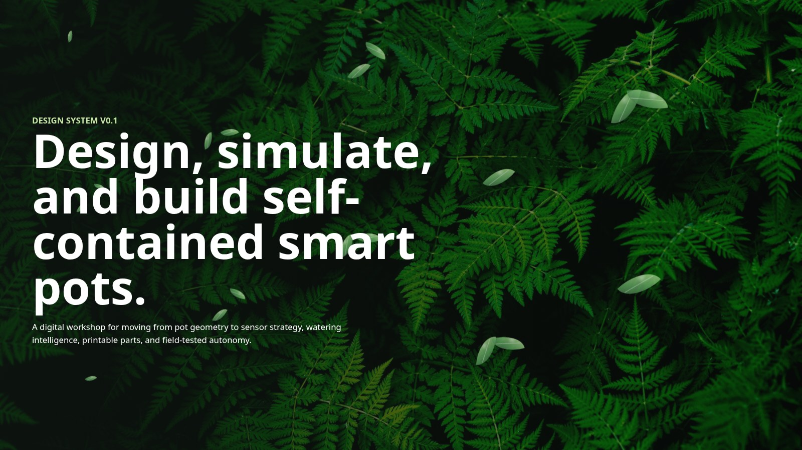

# Plant Watering System



This project is evolving into a public, immersive digital product studio for self-contained, autonomous plant pots.

The intended workflow is:

1. Design a printable pot system with configurable geometry, reservoir layout, electronics bay, sensor channels, and fluid routing.
2. Simulate the design against plant profile, reservoir capacity, ambient temperature, humidity, light, pump dosing, and sensor confidence.
3. Generate production artifacts: CAD/STL parts, bill of materials, firmware configuration, wiring notes, and validation plans.
4. Bring the design into the physical world through 3D printing, electronics assembly, firmware flashing, and hardware-in-the-loop testing.

## Current App

The studio is available at `/` during local development.

It includes:

- project metadata, manifest branding, and SVG favicon
- product direction for a self-contained smart plant pot system
- living pointer-responsive leaves in the opening scene
- a one-page-at-a-time immersive flow
- parametric pot geometry controls
- material and plant profile choices
- Three.js CAD and simulation scenes
- first-pass autonomy, soil volume, water demand, dose, and print-time estimates

This is not yet a real CAD kernel or physics engine. It is the foundation for those layers.

## Product Surface

The current public experience is structured as five immersive pages:

1. **Design system v0.1**: living pointer-responsive hero and product positioning.
2. **CAD 3D**: interactive geometry controls with a Three.js pot concept.
3. **Electronics**: modular controller, sensor, pump, and material selection model.
4. **Simulated world**: environmental controls for temperature, humidity, light, water use, and autonomy.
5. **Start building**: final call to action for moving from concept into a first printable prototype.

The banner image above is a real screenshot of the current local product UI, captured from the live Vite app.

## Product Architecture

The long-term system has six layers:

- CAD design: parametric pot, reservoir, dry electronics bay, sensor spine, tubing channels, service covers, printable split lines
- Simulation: water balance, evaporation, reservoir mass, soil moisture trend, sensor noise, pump flow, failure conditions
- Materials: PETG or ASA for early printed prototypes, optional ceramic or sleeve materials later
- Electronics: ESP32-S3 class controller, capacitive soil moisture sensor, reservoir level sensor, environment sensor, light sensor, pump driver
- Firmware: autonomous dosing loop with soak/observe/fault-detect behavior
- Studio handoff: STL export, BOM, firmware settings, assembly checklist, and test report

## Research Anchors

The first architecture pass is based on these practical constraints:

- Self-watering containers need a reservoir plus overflow/aeration strategy, not just a closed wet chamber. University extension guidance treats the reservoir and overflow path as core design elements.
- Container plants are sensitive to both under-watering and poor drainage. Drainage and air access are part of the watering design, not separate details.
- Capacitive moisture sensing is preferred over cheap resistive probes for longer-lived soil use because resistive probes corrode and drift.
- ESP32-S3 is a strong controller target because it provides Wi-Fi, Bluetooth LE, low-power modes, and an established ESP-IDF workflow.
- JSCAD is a viable browser/CLI path for JavaScript parametric CAD and printable STL workflows.
- Three.js can render STL and WebGL scenes in-browser.
- Rapier provides a modern WebAssembly/JavaScript physics engine for later rigid-body and collision simulation.

Primary references:

- University of Maryland Extension, self-watering containers: https://extension.umd.edu/resource/self-watering-containers
- University of Illinois Extension, container watering and drainage: https://extension.illinois.edu/blogs/flowers-fruits-and-frass/2020-06-22-6-tips-watering-container-gardens
- ESP32-S3 product and ESP-IDF documentation: https://www.espressif.com/en/products/socs/esp32-s3 and https://docs.espressif.com/projects/esp-idf/en/latest/esp32s3/about.html
- Bosch BME280 environmental sensor: https://www.bosch-sensortec.com/products/environmental-sensors/humidity-sensors-bme280/
- JSCAD documentation: https://openjscad.xyz/docs/
- Three.js STL tooling: https://threejs.org/docs/pages/STLLoader.html
- Rapier physics engine: https://rapier.rs/

## Development

Install dependencies:

```bash
npm install
```

Run the local app:

```bash
npm run dev
```

Run tests:

```bash
npm test
```

Run browser UI verification:

```bash
npm run verify:ui
```

Refresh the README banner screenshot after major visual changes:

```bash
mkdir -p docs/assets
npm run docs:banner
```

If your dev server is on a different port, pass it explicitly:

```bash
BANNER_URL=http://localhost:3003/ npm run docs:banner
```

Build for production:

```bash
npm run build
```

Production dependency audit:

```bash
npm run security:audit
```

`verify:ui` starts a local Vite server, opens Chromium with Playwright, and checks desktop/mobile layouts for clipped sections, text overflow, missing CTA, incorrect favicon/title, and blank Three.js scenes. If your system does not expose Chromium at `/snap/bin/chromium`, install Playwright browsers or set `PLAYWRIGHT_CHROMIUM_EXECUTABLE`.

## Next Increments

1. Extract the studio configuration into a typed domain model.
2. Add a real parametric geometry generator and STL export path.
3. Add a simulation model with explicit water balance, pump dosing, sensor uncertainty, and failure states.
4. Define the ESP32 firmware command/telemetry schema.
5. Add prototype BOM, wiring, assembly, and calibration docs.
6. Validate one printable v1 pot before broadening into multi-pot orchestration.
